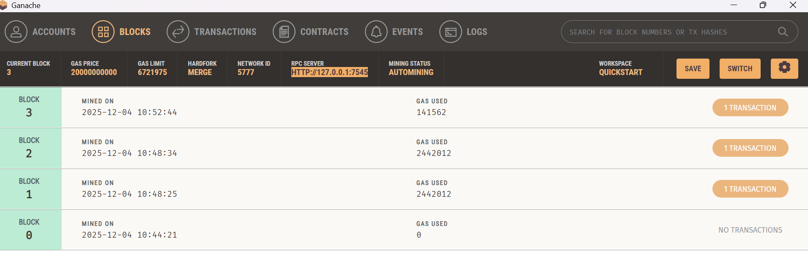
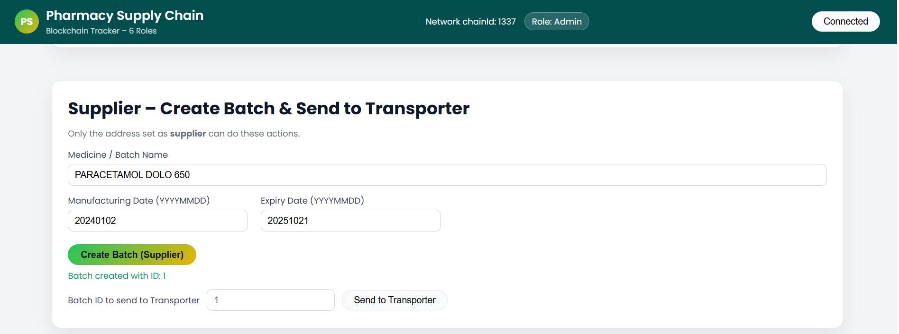
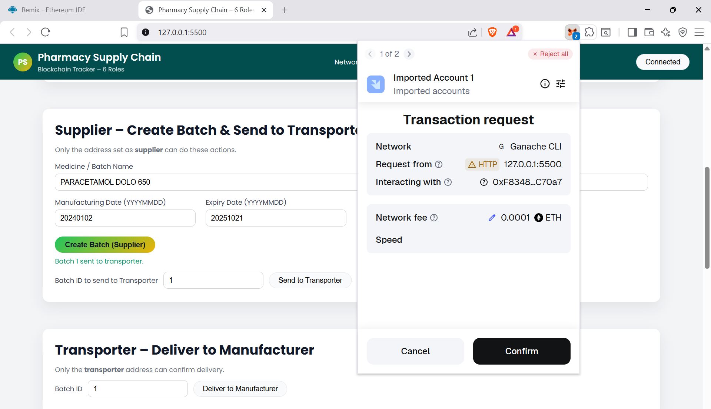
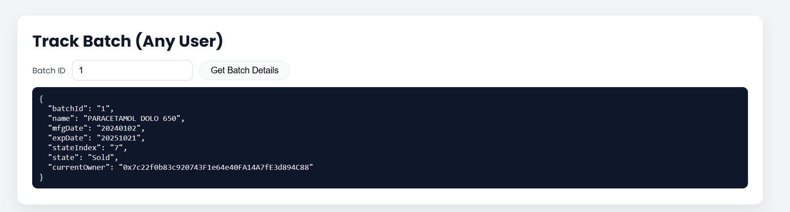

# 💊🔗 Blockchain-Native Pharmaceutical Supply Chain Tracker

Pharmaceutical supply chains involve multiple stakeholders and are highly vulnerable to **counterfeit drugs**, **manual record manipulation**, and **lack of end-to-end visibility**.

This project implements a **blockchain-native pharmaceutical supply chain tracking system** where every medicine batch is recorded **immutably on the blockchain**, ensuring **transparency**, **traceability**, and **trust** — without relying on centralized databases or intermediaries.

Each batch follows a **strictly enforced lifecycle** controlled entirely by a smart contract ⚙️.

---

## 🚀 Key Features

✅ End-to-end medicine batch traceability  
🔐 Role-based access control  
*(Admin, Supplier, Transporter, Manufacturer, Distributor, Pharmacy)*  
🧾 Immutable & transparent blockchain records  
🦊 Decentralized authentication via MetaMask  
⚡ Real-time batch status verification  
❌ No backend server or centralized database  

---

## 🧠 How the System Works

1️⃣ **Admin** deploys the smart contract and assigns role addresses  
2️⃣ **Supplier** creates a new medicine batch on the blockchain  
3️⃣ The batch moves sequentially through:

- 🚚 Transporter  
- 🏭 Manufacturer  
- 📦 Distributor  
- 🏪 Pharmacy  

4️⃣ Each transfer updates the batch state **immutably on-chain**  
5️⃣ **Pharmacy** verifies and marks the batch as sold  
6️⃣ **Any user** can verify batch authenticity using the batch ID  

✨ All operations are **validated and enforced by the smart contract itself**.

---

## 🏗️ System Architecture

The system follows a **fully decentralized blockchain architecture** 🌐 where
all supply-chain operations are executed and validated by smart contracts without
any centralized backend.

<p align="center">
  
</p>

<p align="center">
  <i>Figure: Blockchain-based Pharmaceutical Supply Chain System Architecture</i>
</p>

---

## ⚙️ Technology Stack

- ⛓️ **Blockchain:** Ethereum  
- 📜 **Smart Contracts:** Solidity ^0.8.x  
- 🦊 **Wallet:** MetaMask  
- 🧪 **Local Blockchain:** Ganache  
- 🎨 **Frontend:** HTML, CSS, JavaScript  
- 🔗 **Blockchain Interface:** Web3.js (CDN)  

---

## 📁 Project Structure

```

blockchain-pharmacy-supply-chain/
│
├── contracts/
│   └── PharmacySupplyChain.sol
│
├── frontend/
│   ├── index.html
│   ├── app.js
│   └── style.css
│
├── screenshots/
│   ├── system-architecture.png
│   ├── 01-ganache.png
│   ├── 02-metamask.png
│   ├── 03-admin-roles.png
│   ├── 04-supplier-create.png
│   ├── 05-transporter.png
│   ├── 06-manufacturer.png
│   ├── 07-distributor.png
│   ├── 08-pharmacy.png
│   └── 09-tracking.png
│
├── docs/
│
├── README.md
├── LICENSE
└── .gitignore

```

---

## ▶️ Getting Started

### 📌 Prerequisites

- 🧪 Ganache  
- 🦊 MetaMask browser extension  
- 🧠 Remix IDE  
- 🌐 Modern web browser  

⚠️ **No Node.js, Truffle, or backend setup is required**

---

## 🔧 Setup & Execution

### 1️⃣ Start Ganache
- Launch Ganache and create a workspace  
- Note the RPC URL and account addresses  

### 2️⃣ Configure MetaMask
- Add Ganache as a custom network  
- Import accounts using private keys from Ganache  

### 3️⃣ Deploy Smart Contract
- Open `PharmacySupplyChain.sol` in **Remix IDE**  
- Compile using Solidity **^0.8.x**  
- Deploy using **Injected Provider – MetaMask**  
- Copy the deployed **contract address & ABI**

### 4️⃣ Configure Frontend
- Open `frontend/app.js`  
- Paste the deployed contract address  
- Paste the ABI from Remix  

### 5️⃣ Run Application
- Open `frontend/index.html` in a browser  
  *(or use Live Server)*

---

## 📸 Results & Screenshots

### Ganache Local Blockchain


### MetaMask Wallet Connection


### Admin – Role Assignment


### Supplier – Create Medicine Batch


### Transporter – Delivery Confirmation


### Manufacturer – Dispatch to Distributor


### Distributor – Workflow


### Pharmacy – Verify & Sell


### Batch Tracking Output


---

## 🔍 Batch Verification

Users can verify any batch by entering its **batch ID** 🔎 to view:

- 💊 Medicine name  
- 🏭 Manufacturing date  
- ⏳ Expiry date  
- 👤 Current owner  
- 🔄 Current lifecycle state  

This enables transparency for **consumers**, **pharmacies**, and **regulators**.

---

## 🔐 Security Model

- 🔑 Role-based access enforced on-chain  
- ❌ No hard-coded credentials or private keys  
- ✍️ Transactions signed via MetaMask  
- 🧾 Immutable blockchain data storage  
- 🚫 Frontend manipulation **cannot bypass contract rules**

---

## ⚠️ Configuration Note

The deployed smart contract **address and ABI are intentionally excluded** from
this repository 🔒.

After deploying the contract locally:
1. 📋 Copy the deployed contract address  
2. 📋 Copy the ABI from Remix  
3. ✏️ Paste both into `frontend/app.js`

This ensures **security and environment isolation**.

---

## ⚠️ Limitations

- 🧪 Designed for local blockchain testing (Ganache)  
- 🌡️ No IoT or cold-chain integration yet  
- 📂 No off-chain document storage  
- 🎯 UI optimized for demonstration, not production scale  

---

## ✨ Future Enhancements

- 📱 QR / RFID-based consumer verification  
- 🌡️ IoT-enabled cold-chain monitoring  
- 📦 IPFS integration for certificates & documents  
- 📲 Mobile application support  
- 🌍 Deployment to public testnets (Sepolia / Polygon)  

---

## 👨‍💻 Author

**Darshan Dayanand Naik**  
🚀 Aspiring Artificial Intelligence & Data Science Professional  

📍 Bangalore, India  
🔗 GitHub: https://github.com/darshandayanandnaik01  

---

## 📜 License

📝 This project is licensed under the **MIT License**.
